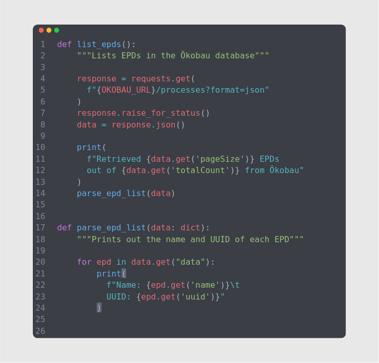

# Ökobau API Example

[Ökobaudat](https://www.oekobaudat.de/en.html) is a database published by the German state which provides EPD.
It is a publicly accessible platform that allows users to search for EPD based on various requirements.

Ökobaudat provides an API (Application Programming Interface) that allows developers to access and retrieve data from
the database programmatically.

This repository is an example of how to use Python with the "requests" library to access the Ökobaudat API.

Whether you're an architect, builder or anyone else in the industry, Ökobaudat is a great tool to help you find
sustainable building materials and products that meet your specific needs.

# Using this Repository

### 1. Prerequisites 
To try out this example make sure that you have the following installed on your computer:
- [Git](https://git-scm.com/book/en/v2/Getting-Started-Installing-Git)
- [Python 3.10](https://www.python.org/)
- [Pipenv](https://pipenv.pypa.io/en/latest/index.html#install-pipenv-today)

### 2. Clone Repository
Clone the repository to your computer:

`git clone`

### 3. Install Python Requirements

- Navigate to the cloned repository or open it in your favorite editor.
- Install the Python packages with Pipenv:
- - `pipenv install`

### 4. Run the Code!

To get a list of EPDs in the Ökobau database use the `list_epds.py` file:

`python src/list_epds.py`

If you wish to obtain information on a specific EPD then use the `fetch_epd.py` file.
**NOTE** that you need to update `epd_id` variable the file to the `uuid` of the EPD that you wish to get information on.

`python src/fetch_epd.py`